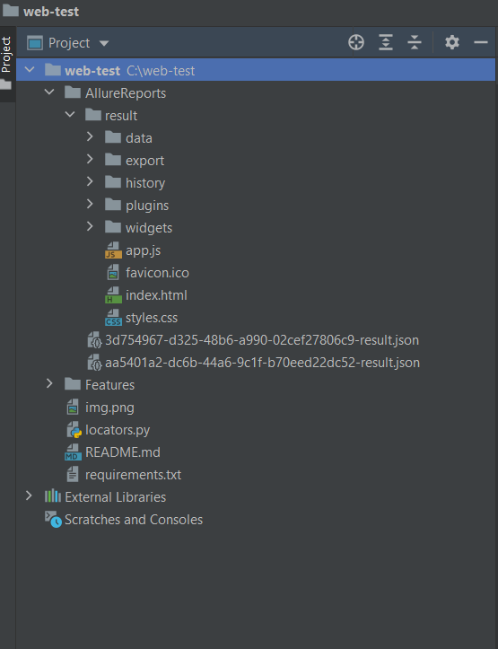
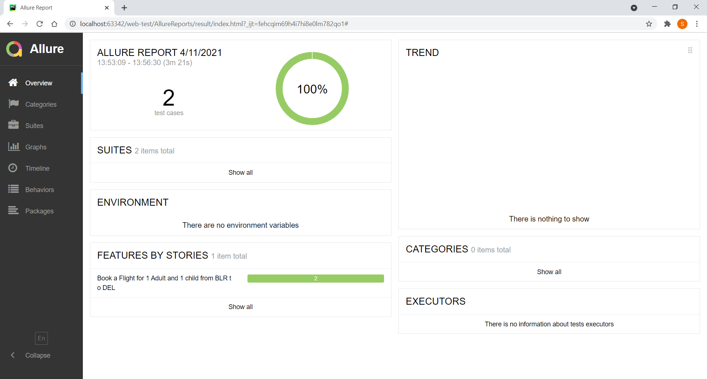

# Selenium with Python using BDD framework

Have automated the https://www.cleartrip.com/ site using selenium with python and framework used is, behave (BDD).
BDD is a development technique that focuses on the system’s behavior. The Given-When-Then approach is used for writing test cases.
It is also known as Gherkins language. 

#Key Benifits of BDD Framework
* Helps reach a wider audience by the usage of non-technical language
* Allowing the requirements to be defined in a standard approach using simple English

#Requirements
* Python needs to be installed (Python Version used: Python 3.9.0 )
* Install the modules by running the requirement.txt (includes selenium and behave) file as 
  pip install requirements.txt ( Use pip3 if you are using pip3)
  
  
#Hierarchy Explanation
* Since we are using behave, the book-flight.feature file consist of the details regarding the feature , scenario under test.
* In book-flight.feature, Gherkins is the language being used, which is based on Given, When and Then.
* In Features/environment.py file,the setup and tear down is done, that is initializing the browser (here I have used WebDriverManager so that we would not need to mention the executable path each time) and closing the same after and before every scenario.
* All the locators needed in this project are stored in locators.py file and the same is imported into functions.py file
* In functions.py,driver actions are converted into modular functions which are then imported into the main Steps/step-impl.py file.

Refer to the screenshot >>

#Running the test
1. Once the requirements are installed and working fine inorder to run the test follow the below steps.
- Open CommandPrompt and Navigate to the project directory.
- Run the command:
    behave Features/book-flight.feature --no-capture
  
2. In order to run the tests and store allure reports, follow the steps as below:
- Open CommandPrompt and Navigate to the project directory.
- Run the command:
    behave -f allure_behave.formatter:AllureFormatter -o allure/results
This will generate allure files in json format.
- Once the files are generated Run the next command:
    allure generate allure/results/ -o allure/reports
  This will help in storing the report in html format which can then be accessed via browser.
  
# Allure Report
Refer to the screenshot of the report >>

  

  